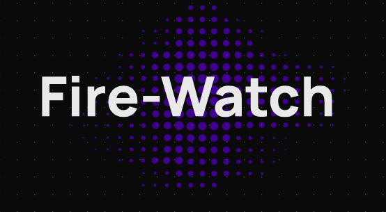

<div align="center">
  
</div>

<br>
<p align="center">
<b>Fire-watch is a simple device monitoring service providing CLI support</b>
</p>

<p align="center">
  
  
  
  
  
  
</p>

## 💡 Project Description

Log and manager IoT device clusters at once through a single dashboard/CLI with realtime alerts.

## 📌 Prerequisites

### 💻 System requirement :

1. Any system with basic configuration.
2. Operating System : Any (Windows / Linux / Mac).

### 💿 Software requirement :

1. Updated browser
2. Node.js installed (If not download it [here](https://nodejs.org/en/download/)).
3. Python installed (If not download it [here](https://www.python.org/downloads/)).
4. Any text editor of your choice.

## Installation 🔧

### Server

Install python dependencies

```
$ pip install -r requirements.txt
or
$ poetry install
```

### Cache

Using [KeyDB](https://keydb.dev) as alternative to [Redis](https://redis.io)

```
echo "deb https://download.keydb.dev/open-source-dist $(lsb_release -sc) main" | sudo tee /etc/aptsources.list.d/keydb.list
$ sudo wget -O /etc/apt/trusted.gpg.d/keydb.gpg https://download.keydb.dev/open-source-dist/keyring.gpg

$ sudo apt update
$ sudo apt install keydb

```

### Server Configurations

- Being a configurable plug-in, `Fire-Watch` can be configured on the fly.
- Configuration options are listed in the `./server/fire_watch/config/config.json`

### Django Patches

Patched `manage.py` the django administrative file with several additional functionalities to sit with the current server architecture.

#### Options

- show-configs.
  - Shows current server configurations.
- list-admins.
  - Shows all present admins.
- create-admin-user.
  - Drawn from native `create super user`, creates an admin user.

* remove-admin-user.

  - Removes admin user.

#### Usage


### Run development server

```
$ bash ./run_server.sh
```

## 📜 License

`Fire-watch` is available under the MIT license. See the LICENSE file for more info.

## 💥 Contributors

<a href="https://github.com/Aradhya-Tripathi/fire-watch/graphs/contributors">

</a>

## 🚨 Forking this repo

Many people have contacted us asking if they can use this code for their own websites. The answer to that question is usually "yes", with attribution. There are some cases, such as using this code for a business or something that is greater than a personal project, that we may be less comfortable saying yes to. If in doubt, please don't hesitate to ask us.

We value keeping this site open source, but as you all know, _**plagiarism is bad**_. We spent a non-negligible amount of effort developing, designing, and trying to perfect this iteration of our website, and we are proud of it! All we ask is to not claim this effort as your own.

So, feel free to fork this repo. If you do, please just give us proper credit by linking back to our website, https://githubsrm.tech. Refer to this handy [quora post](https://www.quora.com/Is-it-bad-to-copy-other-peoples-code) if you're not sure what to do. Thanks!
